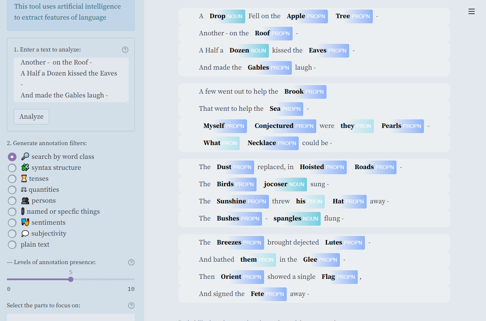

##  Textual Glyphs for Literary Visualisation: a Poetry Analysis Digital Tool for Students.

Language filters that give new perspectives on the text, or uncover some of the text's features, enhanced by their visual presentation.

---
### Use it:

open it in the online with https://share.streamlit.io/iconolocode/textglyphs/main/main.py

or clone the repo and launch with `streamlit run main.py`

---
### Demo video:
https://www.youtube.com/watch?v=wrK1hIhaSPg

---
### Credits
Default poem: *A drop fell on the apple tree* by Emily Dickinson

Video soundtrack: music generated from our paper abstract via Jan Willem Kolkman's tool [LangoRhythm](https://kickthejetengine.com/langorhythm/)
